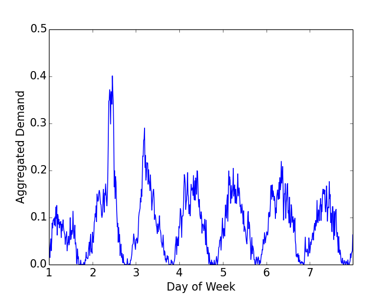
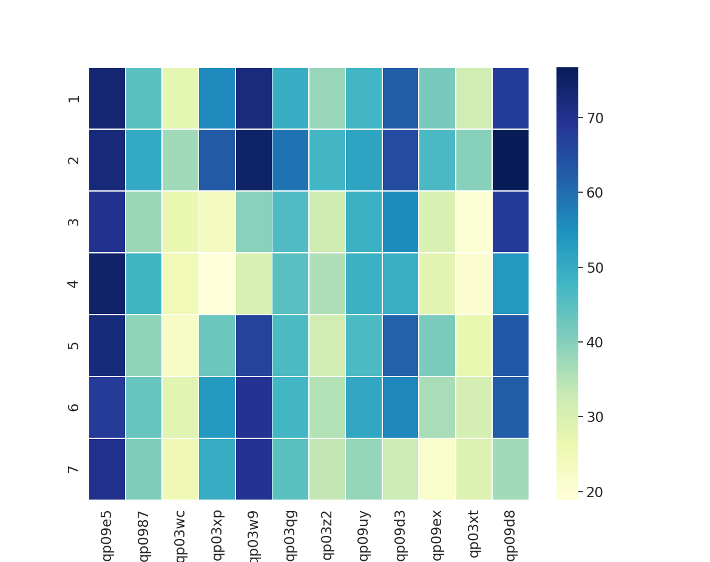

This git repository exposits the code for Grab AI Challenge (Traffic Management) https://www.aiforsea.com/traffic-management, which includes the complete version of the code and comments about the code functions.

The key programs are:

**1) feature_engineering.py.** Given the input of a training/ testing dataset, this program engineers additional features for each data point/record. More details on features engineered are provided in the later sections.

**2) training.py.** This program takes as input the engineered training dataset and learns a machine learning model based on this input. This is discussed in the later sections as well. 

**3) testing.py.** Using the model trainined in 2), this program takes as input the engineered testing dataset and returns the root-mean-squared-error and mean-absolute error of the estimation done by the model.

The following sections show how the programs are used and address the rationales behind the designs.

## Prerequisites (Settings Used)
- Python 2.7
- Pandas >= 0.23.4 (https://pandas.pydata.org/pandas-docs/stable/install.html)
- LightGBM >= 2.2.3 (https://lightgbm.readthedocs.io/en/latest/)
- Geohash (https://pypi.org/project/Geohash/)
- Scikit-Learn >= 0.20.0 (https://scikit-learn.org/) 

## How to Use

### Feature Engineering

This solution starts off with generating additional features for each record in the training and testing dataset. 

1) To begin, place "training.csv" and "testing.csv" in the "/data" folder. 

2) Then run this command:
```
python feature_engineering.py --train_raw=data/training.csv --test_raw=data/testing.csv 
```
The following output should be displayed upon completion.
```
Feature Engineering for Training Data
 Progress 100.00%

Saving File 

Feature Engineering for Testing Data
 Progress 100.00%

Saving File 
```
The above step engineers new features for both the training and testing datasets. For each record in "training.csv", feature_engineering.py uses data of up to two weeks before its correpsonding time instance to generate new features. The similar is done for "testing.csv", with an exception. Specifically, the amount of records in the test dataset available for feature generation is two-weeks long and up to time period T, and the records for T+1 to T+5 are considered for prediction. After performing this step, you will see two new files generated in "/data" folder. They are "engineered_train.csv" and "engineered_test.csv" respectively.

### Model Training 
A machine learning model can now be trained with the following command.
```
python training.py --train_data=data/engineered_train.csv --model=lgbm
```
If you run the code, you can see the output of such a format.

```
Training Begins
...
...
[4000]	training's l1: 0.0190411	training's rmse: 0.0287776	training's mape: 0.0190411
('Feature importances: ', [15817.7150237374, 13.53842082619667, 504.813491538167, 671.8654835671186, 93.34335071593523, ... 202.07622392475605])
Saving Model
Training Completed
```
A saved model "lgbm" should appear in "/models". "lgbm" represents LightGBM, which is the best-performing method for this problem, based on a hold-out validation which uses the records from the last two weeks of "training.csv" (described in the later sections) as test dataset. However, two other methods are available, namely Ridge Regression and Multi-layer Perception. To use these, apply the following respectively.

```
python training.py --train_data=data/engineered_train.csv --model=ridge
```
or 
```
python training.py --train_data=data/engineered_train.csv --model=mlp
```

### Testing
To test the accuracy of the trained model, use the following command.
```
python testing.py --test_data=data/engineered_test.csv --model=lgbm
```
Similar to the training step earlier, "ridge" and "mlp" may too be used instead of "lgbm". However, LightGBM is the best-performing method. If you run the code, you can see an output with such a format:

```
Testing Begins
RMSE: 0.031231505258730734
MAE: 0.02026017982750965
Testing Completed
```
where RMSE denotes root-mean-square-error, and MAE denotes mean-absolute-error.

# Diving In (Further Details)
## Features Used
As highlighted with greater details in https://www.aiforsea.com/traffic-management, each record in "training.csv" consists of the following features: geohash6, day, timestamp, aggregated normalized demand (the thing we want to predict). 

After some processing and feature engineering, several additional features are dervied for each record. In general, the features used for model training fall under three classes: 1) Attributes, 2) Long-term Historical Features, 3) Short-term Historical Features.

### 1) Attributes
Attributes denote features that provide a high-level information about the record. Specifically:

**Temporal Features**
- Day of Week (0-6). The Grab vehicle demands on a weekday may be different from that of a weekend due to different travel characteristics, e.g. traveling to work on weekdays vs. traveling to entertainment outlets on weekends. As such, we include this feature to account for such differences. Note that while the actual day of the week is unknown in the dataset, a value 0-6 is assigned to achieve the same purpose of differentiating the days.

- Period of day (0-95). This is converted from the timestamp feature. This feature is included to take into consideration the demand variation across the day. E.g. the demand during the morning peak hours at a residential area may be higher than that during the non-peak hours.

For example, here is a plot of the aggregated demand of a geohash6 point over a period of 7 days, which are denoted by 1-7. 

<p align="center">

</p>
As observed, there are general intra-day patterns such as peaks in demands before 12 pm on most days of the week. On the broader scale, such intra-day patterns are also day-dependent. For example, the peak demands on days 2 and 3 are larger than that of the rest of the week. In the case of day 2, the peak demand also occurs closer to noontime as compared to that of the rest of the days. This demonstrates the variability of the aggregated demand across the days of the week and time periods of the day, and the importance of including these features. 

\
**Spatial Features** 
- Geohash6. The demand at a point may be very different from the demand at another point. For example, the demand around a shopping mall thoughout the day is likely to be very differnt from the demand at a residential block. As such, we consider geohash6 as another feature. For the sake of clarity and to satisfy the input format requirement for model learning, a unique ID is assigned for each geohash.

Here is a plot of the daily aggregated demand of 12 randomly chosen geohash6 points over a period of 7 days, which are denoted by 1-7. 
<p align="center">

</p>
As observed, the daily aggregated demand patterns are very dependent on the geohash point at which they are recorded. For example, in the case of qp09e5, the demand is relatively high throughout the week. In contrast, for the rest of the points, the demand varies according to the day of the week. This demonstrates the variability of the aggregated demand over different geohash points.

\
A city/town/geograhical space is often categorized into many regions, and each region usually has a particular function. E.g. in Singapore, the central Downtown Core region holds the central business district, while the western Jurong region holds mostly residential buildings. As such, the demand characteristics of points within each region tends to be similar, while the demand characteristics of different regions may be different. E.g. the demand during the morning peak hours at the residential regions may be higher than that of the industrial complexes, since there are more people traveling out of their houses for work then. Due to this reason, the demand of a point is likely not too far from its neighbouring points. To account for such dependencies, we break the map down into regions. Since the city from which the data is obtained is unknown, the map is broken down to 5 x 5 grids, and each point is assigned to its respective grid. A feature as such is then generated for each record:
- Region (Big)

Since a 5 x 5 grid-mapping may not be exactly how the city is regionized in real life, we further create two other versions of the map with 8 x 8 and 12 x 12 grids respectively for a finer-grained represention of the city. As such, two other features are genereated:
- Region (Medium)
- Region (Small)

### 2) Long-term Historical Features
The demand at a certain period on a certain day may depend on the day of week. For example, there may be more people demanding Grab vehhicles towards the downtown business district during 8 am of a weekday than 8 am of a weekend. 

To account for such periodicity, the following features are created. These features are termed long-term historical features.
- Demand at this geohash at the same period of the same weekday 1 week ago
- Demand at this geohash at the same period of the same weekday 2 weeks ago
- Average demand at this geohash at the same period of the same weekday over the past 2 weeks

Furthermore, to leverage such long-term information of the region that a point falls in, three other sets of features are generated. 
- Long-term features for corresponding Region (Big)
- Long-term features for correposnding Region (Medium)
- Long-term features for correponding Region (Small)

### 3) Short-term Historical Features
Although long-term demands highlight the periodicity of demand at a point, the actual demand is highly dependent on the real-time, i.e. short-term, conditions. For example, a point may experience higher demand for Grab vehicles over certain consecutive time periods because an ad-hoc event, e.g. Coldplay concert, just ended a while ago. As such, the short-term demand information over the past few periods is leveraged to capture such information, through the use of the following features.
- Demand at this geohash over period -1 (i.e. previous period)
- Demand at this geohash over period -2
- .....................................
- Demand at this geohash over period -6
- Sum of demand at this geohash over past 2 periods
- Sum of demand at this geohash over past 4 periods
- Sum of demand at this geohash over past 6 periods

For the same reasons mentioned in 2), the same feautres are generated for each of Region (Big), Region (Medium) and Region (Small).  example, the features for Region (Big) are as follows.
- Demand at corresponding Region (Big) over period -1 (i.e. previous period)
- Demand at corresponding Region (Big) over period -2
- .....................................
- Demand at corresponding Region (Big) over period -6
- Sum of demand at corresponding Region (Big) over past 2 periods
- Sum of demand at corresponding Region (Big) over past 4 periods
- Sum of demand at corresponding Region (Big) over past 6 periods

The is repeated for Region (Small) and Region (Medium) to get their respective short-term features. **Note**: If dataset is testing dataset, certain short-term historical demands may not be available for all points/regions. E.g. If the current record 
is recorded at T+5 (We are only allowed to generate features up to T), the only short-term historical demands (over past six periods) available are during T-1 and T. In these cases, extrapolation is done by filling these missing demands with its closest available recorded demand. In the above example, T2-T4 are filled with the demand at T. 

## Problem Definition
This problem is a regression problem. Specifically, the **problem objective** is:
Given the input of a record of features from a particular period of a particular day, where these features comprise of 1) Attributes, 2) Long-term Historical Features and 3) Short-term Historical Features, predict the demand of Grab vehicles at that period.

## Model Choice
For model choice, gradient boost decision tree (GBDT) methods are highly effective for problems with structured inputs (i.e. tables). In particular, LightGBM [1] is one of the most effective and efficient GBDT methods. As such, we leverage LightGBM for this problem.

## Experiments
To study the effectiveness of the proposed solution, some experiments are conducted. In this section, the characteristics of the dataset is first introduced. Then, the impacts of different types of features are discussed. Finally, the effectiveness of different methods for demand estimation are compared.

### Training Data Characteristics
| Statistical Index| Value |
| :---: | :---: |
| Min. Latitude | -5.48 | 
| Max. Latitude | -5.24 | 
| Min. Longitude | 90.6  |
| Max. Longitude | 91.0|
| Mean Aggregated Demand | 0.105|
| 10-percentile Aggregated Demand | 0.00651|
| 90-percentile Aggregated Demand | 0.249|

The above table shows some statistics of "training.csv". The geospatial points span an area of 26.5 km x 44.3km. As observed, the mean aggregated demand in the dataset is relatively low (0.105). The 90-percentile aggregated demand also shows that the majority of the demand values fall below 0.249, which is a very low value. This shows that across the whole geograhical space sampled, the majority of the demands are relatively low as compared to certain few points that have very high demands.

### Impact of Different Features
To demonstrate the impact of the built model, a hold-out validation using solely "training.csv" is carried out. Specifically, records from the last 2 weeks of "training.csv" are used as testing data, and the rest of "training.csv" as training data. Within the 2 weeks of testing data, all records except the ones obtained from the last 5 periods are used to generate features. Groups of **features are incrementally added** and resulting effectiveness using LightGBM is derived. The group of features considered are:

1) **A.** This group consists of only 1) geohash6, 2) day of week, 3) period.
2) **B.** This group consists of all features in **A**, and in addition, the geohash-based (not regional) long-term historical features.
3) **C.** This group consists of all features in **B**, and in addition, the geohash-based short-term historical features.
4) **D.** This group consists of all features in **C**, and in addition, all the region-based features.

The root-mean-square-error (RMSE) and mean-absolute-error (MAE) errors are as follows, with the best accuracy in bold. 

| Features Group| RMSE |MAE |
| :---: | :---: | :---: |
| **A** | 0.0613 | 0.0341 |
| **B** | 0.0454 | 0.0266 |
| **C** | 0.0316  | 0.0204  |
| **D** | **0.0312**  | **0.0203** |

As observed, the group which consists of all attribute, short-term and long-term features, i.e. **D**, yields the best performing accuracy. Adding long-term historical point-based features, i.e. **B**, improves the estimation by about 26% from **A**. The further addition of short-term historical point-based features improves the estimation by about 30%. Finally, adding the region-based features also slightly improves the accuracy. One thing to note is that the impact/improvement brought about by region-based information is not as pronounced as what was expected. However, the decision is made to retain these features as there is still evidence of some improvement, and the accuracy may be better in the actual testing dataset, "testing.csv".

Based on the feature importance evaluation of LightGBM, the top 10 (out of 54) most important features (gain improvements brought about by that feature) are as follows.

| Feature| Gain-based Importance |
| :---: | :---: |
|Demand at Period -1| 3913129.4369661957
|Sum of Demand over Past 2 Periods| 1309120.9149529226| 
|Sum of Demand over Past 4 Periods| 138575.2317873165|
|Avg. Demand at Same Period over Past 2 Weeks| 48529.97696241364|
|Period |16250.700955118984|
|Geohash6 |15817.7150237374|
|Demand at Same Period 2 Weeks Ago| 5863.327200401574|
|Sum of Demand over Past 6 Periods |4361.7583310343325|
|Demand at Perod -2 |2577.925106290728|
|Demand at Same Period 1 Week Ago| 2189.9992196187377|

As observed, the long-term and short-term features are generally very important in the estimation, and so are certain attribute  features, such as the period of day and the geohash6.

### Comparison across Popular Methods
Experiments are also conducted to compare the accuracy of LightGBM against two other popular methods, Ridge Regression and Multi-layer Perceptron (MLP). For more information about the settings used for each method, please refer to "training.py". The feature set used in these experiments is **D**. Although embedding of categorical features is done automatically in LightGBM API, it has to be done manually for Ridge Regression and MLP, by applying one-hot encoding. The results are as follows.

| Method| RMSE |MAE |
| :---: | :---: | :---: |
| Linear Regression| 1740 | 4.26 |
| Ridge Regression| 0.0330 | 0.0214 |
| MLP | 0.168 | 0.0987 |
| LightGBM | **0.0312**  | **0.0203** |

As observed, LightGBM has the best performance, which demonstrates the effectiveness of using gradient-boosting decision tree methods for problems like this. The RMSE of 0.0312 and MAE of 0.0203 highlight the fairly high accuracy of LightGBM, considering that the majority of the demands fall below 0.249 as shown earlier. Specifically, the RMSE and MAE are 12.5% and 8.2% of this particular demand. Note that the errors for Linear Regression are extremely large. This is due to overfitting in linear regression, exacerbated by the large number of dummy variables that come from one-hot encoding. As such, since ridge regression has a regularizer term that penalizes large coefficients and minimizes overfitting, it performs much better than linear regression. MLP, on the other hand performs worse than LightGBM.

## Limitations and Areas of Improvements
Due to the anonymity of the geo-locations of the data, city-specific optimizations are omitted. If city-specific information is available, more accurate features can also be derived. For example, places like Singapore often have government-planned regions, e.g. Downtown Core, Changi, etc. Each of these regions serves a particular function, e.g. business district or residential, and it may benefit the estimations if such finer-grained information is used.

The state of the art method focuses on estimating the regional demand [2], where the area of the regions considered is much larger than the area covered by a geohash (in our case). Although it is deep-learning based, it requires the information of the road network. As such, if more information like the city-specific road network is available, further optimization via other methods can also be applied. Furthermore, apart from [2] which requires city-specific road network information, the other notable deep learning-based methods focus only on region-based demand prediction, and only demonstrate its superiority over gradient boost methods when short-term demand is considered [3]. Specifically, they do not use the long-term historical demands that have been shown to be effective in our case. As such, LightGBM is still safely more reliable and is the chosen model for this problem for accuracy-sake. 

Finally, additional ensembles may be applied to fine-tune the results slightly further as well.

## References
[1] [LightGBM](https://lightgbm.readthedocs.io/en/latest/)

[2] [Spatiotemporal Multi-Graph Convolution Network for Ride-hailing Demand Forecasting](http://www-scf.usc.edu/~yaguang/papers/aaai19_multi_graph_convolution.pdf)

[3] [Deep Multi-View Spatial-Temporal Network for Taxi Demand Prediction](https://faculty.ist.psu.edu/jessieli/Publications/2018-AAAI-taxi-demand.pdf)

[4] [Forecasting Taxi Demands with Fully Convolutional Networks and Temporal Guided Embedding](https://openreview.net/pdf?id=BygF00DuiX)

